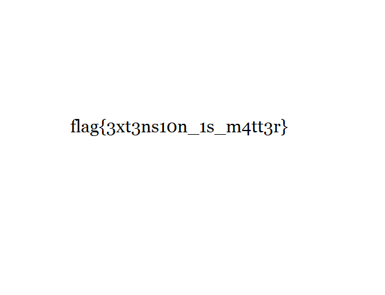

# Identity
- - - -

identity.zip 파일을 열러고 하면 지원하지 않는 형식이라는 문구와 함께 열리지 않는다.

* HxD

hexeditor로 확인해보니 이파일은 png파일이다.
그래서 확장자를 png로 바꿔보니 flag 이미지가 나왔다.

## flag
- - - -
flag{3xt3ns10n_1s_m4tt3r}

* identity.png

#IGRUS_CTF #IGRUS_CTF/Forensics