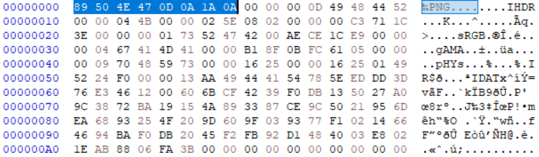
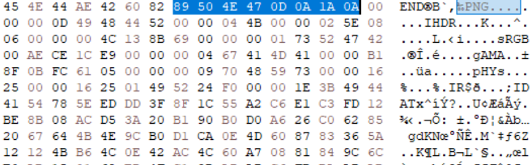

# Assemble
- - - -

파일에는 고유한 값이 존재하는데 png 파일은 89 50 4E 47 0D 1A 0A 이다.

* assemble.png

* assemble.png

파일의 중간에도 이 고유의 값이 보이는데 이 파일은 여러개의 이미지 파일을 하나로 묶어둔 파일이다.
그래서 고유의 값을 기준으로 위에서부터 제거해 가며 따로 png파일로 만들면 된다.

## flag
- - - -
flag{d0_y0u_kn0w_m4g1c_numb3r?}

#IGRUS_CTF #IGRUS_CTF/MICS