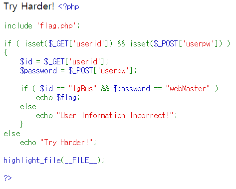

# Verify
- - - -

* verify


web	페이지에 들어가면 위와 같은 php 소스가 보인다.
get 방식으로 userid란 이름에 IgRus, post 방식으로 userpw 란 이름에 webMaster를 전송해주면 되는 문제이다.

* form
```
<form method='post' action='http://igrus.cf:8084/?userid=IgRus'>
    <input type ='text' name='userpw'>
    <input type = 'submit'>
</form>
```

만들어진 text input 에 webMaster 를 입력해주면 flag가 출력된다.


## flag
- - - -
flag{g3t_4nd_p0st}


 
#IGRUS_CTF #IGRUS_CTF/Web